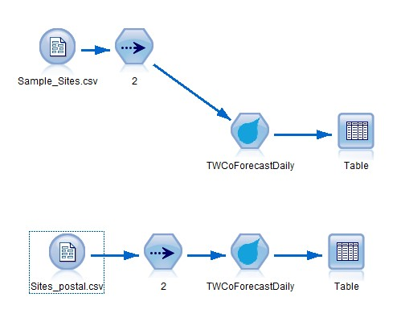
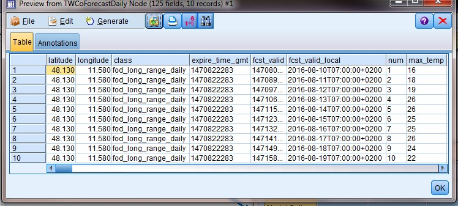

# Extension for TWCo Forecast Daily

# Overview

# Overview for Standard Site-Based Historical Observations
10 Day Daily Forecast - Forecast for 24-hour periods starting today for the next 10 days including daytime and nighttime.  Includes narrative text for the language requested

# Notes

# Reference
[The Weather Company](http://www.theweathercompany.com/)
[Historical Weather](http://goo.gl/AoxGl3)

---
Requirements
----
- IBM SPSS Modeler v18
- R Essentials for SPSS Modeler plugin 

More information here: [IBM Predictive Extensions][2]

---
Installation instructions
----
1. Download the extension.
2. Install extension from [gallery][2] 

---
Examples stream and data
----
Example folder include example stream and sample data

---
License
----

[Apache 2.0][1]

Contributors
----
- Yu Wenpei [(mail)](yuwenp@cn.ibm.com)

[1]:http://www.apache.org/licenses/LICENSE-2.0.html
[2]:https://developer.ibm.com/predictiveanalytics/downloads/#tab2
